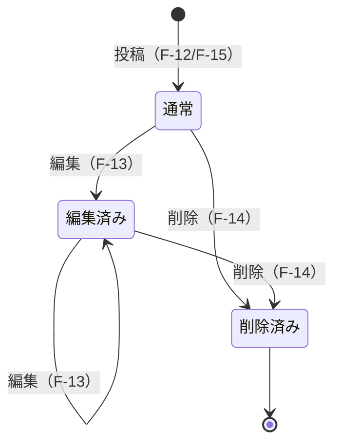
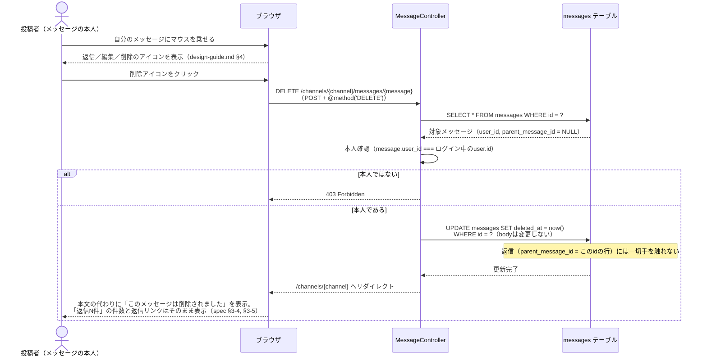

# ふるまいの設計

このファイルは `docs/spec.md`、`mockup/`、`docs/design/`（`features.md`・`questions.md`・`screens.md`・`data.md`・`permissions-api.md`）の3つだけを根拠にしている。この3つに無いことは想像で足していない。クラス図は作らない（LaravelのMVCの形にそのまま乗る）。

---

## 1. 状態遷移図（メッセージ）

対象はメッセージ1件の状態のみ。返信の有無（「返信N件」の表示）はメッセージ自身の状態ではなく、それを親として指す別のメッセージが存在するかどうかで決まる値（`data.md` 2-4「返信件数は都度COUNTで数える」）なので、この図には含めない。

- **通常**: 投稿した本文がそのまま表示される。
- **編集済み**: `edited_at` が入っている。本文の末尾に「編集済み」の印が付く（spec §3-4、`design-guide.md`）。何度編集してもこの状態のまま（`questions.md`「どのQにも当たらなかった回答」：編集回数・期限の制限は無い）。
- **削除済み**: `deleted_at` が入っている。本文の代わりに「このメッセージは削除されました」が表示される（spec §3-4）。**終端状態**で、ここから編集・削除には戻せない。削除済みメッセージは本文自体を表示しない（`design-guide.md` §4）ため、編集アイコンを出しても編集する対象が無く、削除アイコンも「これ以上できることがない」ので、どちらも表示しない設計にした（※設計判断。自分の削除済みメッセージに対する編集・削除アイコンの有無は、モックアップに直接の例が無いための推論）。**返信（F-15）だけは削除済みでも受け付ける**（`questions.md`「どのQにも当たらなかった回答」：「続けられて構いません。むしろ、そこで会話が続けられなくなるほうが困ります」）。

---

## 2. シーケンス図（代表: スレッドの返信が付いたメッセージを、書いた本人が削除したとき）

`channel-show.html` に実例がある状況（返信が付いたメッセージが削除済みになっている）を土台にした。

**削除後もそのまま続くこと**（`questions.md`「どのQにも当たらなかった回答」が根拠）:

- スレッド（SC-08）を開くと、返信は削除前とまったく同じ内容で表示される（返信そのものは一切変更していないため）。
- この削除済みメッセージに対して、新しい返信を続けて投稿できる（F-15はメッセージの削除状態を確認しない）。

---

## 3. 例外方針

| 状況 | 方針 | 根拠 |
|:--|:--|:--|
| 未ログイン、またはログイン中に**セッション（ログイン）の有効期限が切れた**状態で、ログインが必要な画面・操作にアクセスした | ログイン画面（`/login`）へ送り直し、あらためてログインしてもらう | spec §2「ログインしていない人は公開APIから読むだけ」。Laravel標準の認証ミドルウェアの挙動に乗る（セッション切れも未ログインと同じ扱いになる） |
| ログアウトしたあと、**ブラウザの「戻る」**でログインが必要な画面に戻ろうとした | ログインが必要な画面の応答に `Cache-Control: no-store` を付けておき、ブラウザに前の画面を復元させない。結果として上の行と同じく `/login` へ送り直される | ※設計判断。`acceptance.md` TP-1-10 が「ログアウト後にブラウザの『戻る』でチャンネル画面に戻ろうとしても、ログイン画面に送り返される」を確かめる観点として挙げているが、ブラウザの bfcache は `no-store` が無いと認証ミドルウェアを通さずにページを復元してしまい、この観点を満たせないため |
| フォームを開いたまま時間が経ち、**CSRFトークンの有効期限が切れた**状態で送信した | ログイン画面へは送らず、送信そのものを419 Page Expiredで拒否する。元のページに戻って入力し直してもらう | Laravel標準のCSRF保護（`VerifyCsrfToken`ミドルウェア）に乗る。spec・mockup・docs/design/のどこにも直接の記載は無く、フレームワーク標準の挙動に任せる |
| ログイン済みだが権限が無い操作をした（例: 作成者でない人がチャンネル編集を叩く、本人でない人がメッセージ編集を叩く） | 403 Forbidden | `permissions-api.md` 1章の権限マトリクス。クライアント側でボタンを隠していても、サーバ側で必ず再確認する |
| 既に削除済みのメッセージへ、編集・削除のリクエストが来た（本人による直接URLアクセスを含む） | 403で拒否する | 1章の状態遷移図のとおり「削除済み」は終端状態で、そこから編集・削除はできない。UI側では編集・削除アイコンを出していないが、クライアント側の制御だけに頼らずサーバ側でも状態を確認する（同じ原則を下の「確認入力の不一致」にも適用） |
| 存在しないチャンネル・メッセージへのアクセス、または自分がメンバーでないプライベートチャンネルへの直接アクセス（URLを直接叩いた場合を含む） | どちらも同じ404（区別しない） | `questions.md` Q-04「存在自体が分からない状態にしたい」を、一覧表示だけでなく直接アクセスにも一貫して適用した。`permissions-api.md` 3章の公開APIと同じ方針 |
| 入力チェックエラー（文字数超過・必須未入力・チャンネル名重複など） | Laravel標準のバリデーションエラー（フォームへリダイレクト＋エラーメッセージ表示） | 文言は `screens.md` 4章のとおり |
| チャンネル削除の確認入力とチャンネル名が一致しない | 削除ボタンをJSで非活性にする（`screens.md` SC-06）が、**一致の確認はサーバ側でも必ず再検証**し、一致していなければ削除を実行しない | クライアント側の制御（JS・非活性ボタン）だけに頼らない一般原則。JSを無効化されても誤って削除されないようにするため |
| 同時編集・同時削除の競合（例: 本人が2つのタブで同じメッセージを同時に編集する） | 特別な排他制御（楽観的ロックなど）は設けず、後に保存されたほうを有効にする（後勝ち） | ※設計判断。編集・削除ができるのは投稿者本人だけ（`permissions-api.md`注記[2]）なので、競合が起こり得るのは本人の別セッション同士に限られ、業務上のリスクが小さいと判断した |
| 想定外のサーバエラー（500番台など） | Laravel標準のエラーページに任せ、この設計では個別定義しない | spec・mockup・docs/design/のどこにも記載が無いため |

**判定の順序**（実装時に追記、2026-08-18）: 上の表には403を返す行と404を返す行の両方があり、1つのリクエストで両方に当てはまることがある（自分がメンバーでないプライベートチャンネルの編集URLを、作成者でない人が直接叩いた場合など）。このとき返すのは**404**とする。**「見えるか（見えなければ404）→ 作成者・本人か（違えば403）」の順に判定する**、と決めた（※設計判断: 403を先に返すと「権限は無いが、そのIDのチャンネルは存在する」と伝わってしまい、Q-04「存在自体が分からない状態にしたい」が崩れるため。この順序は表の各行の方針を変えるものではなく、両方に当てはまるときにどちらを先に見るかを決めたもの）。

---

## 根拠にした資料

- `docs/spec.md`（全文、とくに §2, §3-4, §3-5）
- `mockup/channel-show.html`, `channel-edit.html`, `thread.html`, `design-guide.md`
- `docs/design/features.md`
- `docs/design/questions.md`（クライアントの回答、どのQにも当たらなかった回答）
- `docs/design/screens.md`
- `docs/design/data.md`
- `docs/design/permissions-api.md`
