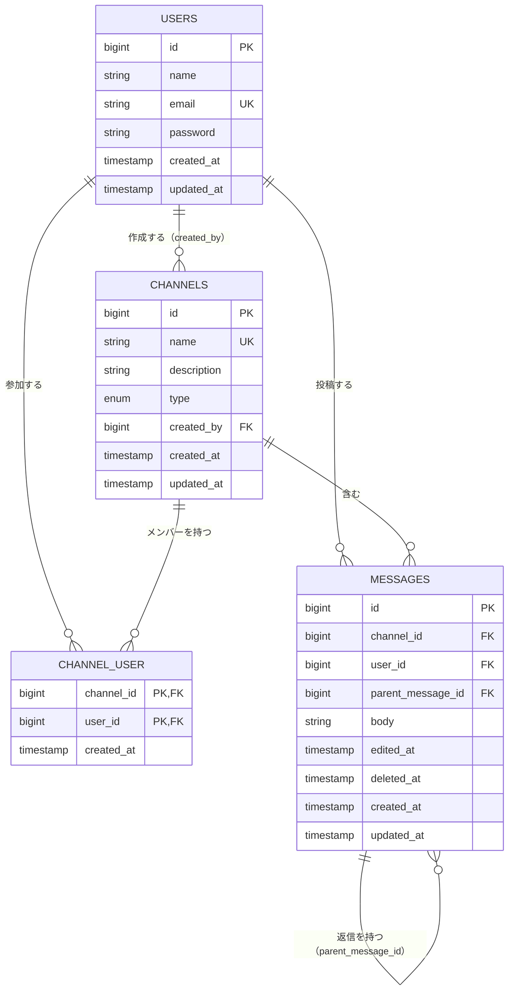

# データ設計

このファイルは `docs/spec.md`、`mockup/`、`docs/design/`（`features.md`・`questions.md`・`screens.md`）の3つだけを根拠にしている。この3つに無いことは想像で足していない。クラス図は作らない（LaravelのMVCの形にそのまま乗る）。

## 0. 前提

**メッセージの削除は「案1：行を残し、削除日時（`deleted_at`）を持つ。本文はそのまま残す」に決定した**（このやり取りで確定。決めた理由と、比較した案は `questions.md` に追記予定）。この決定にともない、本文を返す・検索する処理はすべて `deleted_at IS NULL` を明示的に条件へ入れる必要がある。これは3章の該当箇所に注記した。

スコープ外にしたもの: Laravelの認証・セッション基盤が使う `sessions` / `password_reset_tokens` / `personal_access_tokens` / `cache` / `jobs` などのテーブルは、`docs/spec.md`・`mockup/`・`docs/design/` のどれにも業務要件としての根拠が無いため、このファイルでは扱わない（アプリのドメインではなくフレームワークの基盤機能のため）。

---

## 1. ER図

`MESSAGES ||--o{ MESSAGES` は自己参照（`parent_message_id` が自分自身のテーブルの `id` を指す）。スレッド返信はメッセージそのものであり、独立したテーブルにはしていない（`thread.html` の返信の見た目・編集済み表示・削除表示が `channel-show.html` のメッセージと完全に同じ型のため。`screens.md` 3-8「SC-08はSC-05と同じ」と揃える）。

---

## 2. テーブル定義書

### 2-1. users（社員）

| 列名 | 型 | NULL | デフォルト | 制約 | 説明・根拠 |
|:--|:--|:--|:--|:--|:--|
| id | BIGINT UNSIGNED | NOT NULL | AUTO_INCREMENT | PK | |
| name | VARCHAR(30) | NOT NULL | | | 表示名。30文字上限（spec §5-1）。`register.html` |
| email | VARCHAR(255) | NOT NULL | | UNIQUE | ログインID。ログインの一意性に必要（`login.html` のエラー文、spec §3-1）。**文字数上限はspecに記載が無い**（4章参照）。実装では Laravel 既定の `VARCHAR(255)` を採ることにした（2026-08-18） |
| password | VARCHAR | NOT NULL | | | ハッシュ化して保存。平文は8文字以上・上限なし（spec §5-1）。ハッシュ値自体の列長はハッシュアルゴリズムに依存する実装詳細で、業務要件ではないため未指定 |
| created_at | TIMESTAMP | NOT NULL | | | |
| updated_at | TIMESTAMP | NOT NULL | | | |

削除: ユーザーを削除する機能は無い（`features.md` 2-1「管理者による全体管理」は作らない）。物理削除・論理削除のどちらも実装しない。

補足（実装時に追記、2026-08-18）: Laravel が最初から用意している `users` のマイグレーションには `email_verified_at` と `remember_token` があるが、**どちらも落として上の表の6列ちょうどにした**。前者は登録時のメール確認を作らないため（`features.md` 2-2 ／ `questions.md` Q-01 で暫定除外）、後者は `mockup/login.html` にログイン状態を保持するチェックボックスが無いため。

### 2-2. channels（チャンネル）

| 列名 | 型 | NULL | デフォルト | 制約 | 説明・根拠 |
|:--|:--|:--|:--|:--|:--|
| id | BIGINT UNSIGNED | NOT NULL | AUTO_INCREMENT | PK | |
| name | VARCHAR(50) | NOT NULL | | UNIQUE | 50文字上限（spec §5-1）。重複不可（`questions.md` Q-03の回答） |
| description | VARCHAR(200) | NULL | | | 200文字上限（spec §5-1）。任意項目（`channel-new.html` に`*`が無い） |
| type | ENUM('public','private') | NOT NULL | | | 公開／プライベート（spec §3-2）。作成後に変更不可（`channel-edit.html`「公開範囲はあとから変更できません」）。**変更不可はアプリ側で編集フォームに項目を出さないことで担保し、DB制約としては課さない** |
| created_by | BIGINT UNSIGNED | NOT NULL | | FK → users.id | 作成者。名前・説明の編集とチャンネル削除ができるのはこの人だけ（spec §3-2） |
| created_at | TIMESTAMP | NOT NULL | | | |
| updated_at | TIMESTAMP | NOT NULL | | | |

削除: **物理削除**。チャンネルの削除確認（`channel-edit.html`）は「この操作は取り消せません」と明記されており、削除されたメッセージのようなプレースホルダー表示も画面一式のどこにも無い。かつ`questions.md`（どのQにも当たらなかった回答）で「チャンネルを消したら中のメッセージも一緒に消えて構いません」と回答されている。この2点から、チャンネルは論理削除ではなく物理削除とし、`channel_user` と `messages`（返信を含む全件）を `ON DELETE CASCADE` で道連れに物理削除する設計にした。**メッセージ個別の論理削除（0章の案1）とは別物**であることに注意。

### 2-3. channel_user（チャンネルとユーザーの中間テーブル）

| 列名 | 型 | NULL | デフォルト | 制約 | 説明・根拠 |
|:--|:--|:--|:--|:--|:--|
| channel_id | BIGINT UNSIGNED | NOT NULL | | PK（複合）, FK → channels.id, ON DELETE CASCADE | |
| user_id | BIGINT UNSIGNED | NOT NULL | | PK（複合）, FK → users.id | |
| created_at | TIMESTAMP | NOT NULL | | | 参加日時 |

サロゲートIDは持たない（channel_idとuser_idの組で一意という以外に固有の意味を持つ行ではないため）。`updated_at` も持たない（メンバー行は「参加している／いない」のどちらかで、更新という状態が無いため）。

補足（実装時に追記、2026-08-18）: `updated_at` を持たない決めを実装で外さないため、マイグレーションでは Laravel の `$table->timestamps()` を**使わず** `$table->timestamp('created_at')` を手書きする（`timestamps()` は `updated_at` も作ってしまう）。Eloquent 側も同じ理由で `belongsToMany(...)->withTimestamps()` は使わず、`withPivot('created_at')` で読み、行を足すときは `attach($id, ['created_at' => now()])` のように `created_at` を明示する。

このテーブルの使われ方: spec §3-2「チャンネルを作った人は、そのチャンネルのメンバーになります」はチャンネル種別を問わない一般的な記述のため、**公開・プライベートを問わず作成時に作成者の行を1件作る**。公開チャンネルではこれ以上行が増えない（spec §3-3「公開チャンネルは...メンバーの追加・削除の操作は要りません」、`members.html`「この画面を開けるのはプライベートチャンネルを作った人だけ」）。プライベートチャンネルの可視性判定（`questions.md` Q-04: 非メンバーには一覧にも出さない）は、このテーブルに該当ユーザーの行があるかどうかで判定する。

削除: F-11（メンバーを外す）で該当行を物理削除。作成者の行は、作成者自身を外せない（`questions.md`「どのQにも当たらなかった回答」）というアプリ側の制御で保護する（DB制約ではなく業務ロジックで守る想定。理由: 「作成者＝そのチャンネルのcreated_by」を都度参照すれば判定できるため、DB側に追加の制約は不要と判断した）。

### 2-4. messages（メッセージ・スレッド返信を含む）

| 列名 | 型 | NULL | デフォルト | 制約 | 説明・根拠 |
|:--|:--|:--|:--|:--|:--|
| id | BIGINT UNSIGNED | NOT NULL | AUTO_INCREMENT | PK | |
| channel_id | BIGINT UNSIGNED | NOT NULL | | FK → channels.id, ON DELETE CASCADE | 返信もそのメッセージが属するチャンネルのidを持つ（親の`channel_id`と常に一致する）。チャンネル単位の取得を素直なWHERE句1本で書けるようにするための意図的な冗長化 |
| user_id | BIGINT UNSIGNED | NOT NULL | | FK → users.id | 投稿者。編集・削除できるのは本人だけの判定に使う（spec §3-4） |
| parent_message_id | BIGINT UNSIGNED | NULL | | FK → messages.id, ON DELETE CASCADE | NULLならチャンネルの本流に流れる「元メッセージ」。値が入っていればその`id`への返信（スレッド）。返信はさらに返信を持てない（`questions.md` Q-07の回答）が、これは**アプリ側でチェックする業務ルールであり、DB制約では強制しない** |
| body | VARCHAR(1000) | NOT NULL | | | 1000文字上限（spec §5-1）。0章の決定により、削除済みでも本文はクリアされず残る |
| edited_at | TIMESTAMP | NULL | | | NULL以外なら「編集済み」の印を出す（spec §3-4、`design-guide.md`）。編集回数・期限の制限は無い（`questions.md`「どのQにも当たらなかった回答」） |
| deleted_at | TIMESTAMP | NULL | | | NULL以外なら「このメッセージは削除されました」のプレースホルダー表示にする（spec §3-4）。0章の決定どおり、本文(`body`)はそのまま残す |
| created_at | TIMESTAMP | NOT NULL | | | 投稿日時。並び順は古い→新しい（`questions.md`「どのQにも当たらなかった回答」） |
| updated_at | TIMESTAMP | NOT NULL | | | Laravelの自動更新用。「編集済み」の判定には使わない（編集以外の更新＝削除でも動くため、判定は`edited_at`を専用に用意して切り分けた） |

削除: **論理削除（0章の案1）**。`deleted_at` を立てるだけで `body` は変更しない。返信件数は都度 `COUNT(*) WHERE parent_message_id = ?` で数える想定とし、キャッシュ用の件数カラムは持たない（この規模のアプリで整合性維持のコストを払うほどの理由が無いため）。

**重要な注意（0章の決定の影響）**: `body` を消さないため、本文を外部へ出す・検索対象にする処理は、すべて `deleted_at IS NULL` を明示的に条件へ入れないと削除済みの本文が漏れる。どこで入れる／入れないかは3章のCRUD表に注記した。

削除済みメッセージにも返信を続けられる（`questions.md`「どのQにも当たらなかった回答」）ため、`deleted_at` が立っていても `parent_message_id` でその行を親として指す新しい行は作れる（アプリ側で禁止しない）。

補足（実装時に追記、2026-08-19）: **Laravel の `SoftDeletes` トレイトは使わない**と決めた。`deleted_at` は `$table->timestamp('deleted_at')->nullable()` を手書きした普通の列として持ち、Eloquent 側は `$casts` で `datetime` にするだけにする。理由は次の2つ。

- `SoftDeletes` のグローバルスコープは `deleted_at` が入っている行を既定でクエリから外すが、この設計では F-06（チャンネル表示）・F-16（スレッド表示）が **`deleted_at` を問わず全件取得する**のが正（3章）。トレイトを使うと、この2か所で毎回 `withTrashed()` を書いて既定を打ち消すことになり、書き忘れた瞬間に「このメッセージは削除されました」の枠ごと画面から消える。逆に、外したいのは検索（F-17）と公開API（F-19）の2か所だけで、そちらは3章のとおり `deleted_at IS NULL` を明示的に書く方針なので、既定を「全件」にしたほうが設計と一致する
- トレイトを付けると `$model->delete()` の意味が物理削除から論理削除に変わる。ここでは逆に、**トレイトを付けないので `$message->delete()` は物理削除になる**。論理削除は `Message::markAsDeleted()`（`deleted_at` だけを更新し `body` は触らない）を専用に生やし、削除の入口をこの1本に絞る

---

## 3. CRUD表

F-xx を行、テーブルを列にした。`-` はそのテーブルに対する操作が無いことを示す。

| ID | 機能 | users | channels | channel_user | messages |
|:--|:--|:--|:--|:--|:--|
| F-01 | 新規登録 | C | - | - | - |
| F-02 | ログイン | R | - | - | - |
| F-03 | ログアウト | - | - | - | - （4章「埋まらない行」参照） |
| F-04 | チャンネル一覧表示 | R（作成者名の表示） | R | R（Q-04：非メンバーの private を除外） | - |
| F-05 | チャンネル作成 | - | C | C（作成者を自動追加、spec §3-2） | - |
| F-06 | チャンネル表示（メッセージ一覧） | R（投稿者名の表示） | R | R（private時のアクセス可否判定） | R（`deleted_at`を問わず全件取得し、表示側でプレースホルダに差し替え。`WHERE parent_message_id IS NULL`） |
| F-07 | チャンネル編集 | - | R, U | - | - |
| F-08 | チャンネル削除 | - | D | D（CASCADE） | D（CASCADE。0章の論理削除とは別枠の物理削除） |
| F-09 | メンバー一覧表示 | R（氏名・メール表示） | R | R | - |
| F-10 | メンバー追加 | R（Q-06：氏名/メール完全一致で検索） | R（private・作成者チェック） | R, C（`screens.md` 4章「すでにメンバーです」の判定に既存行の確認が必要） | - |
| F-11 | メンバー削除 | - | R（作成者チェック） | D | - |
| F-12 | メッセージ投稿 | - | R（書き込み可否判定） | R（private時） | C |
| F-13 | メッセージ編集 | - | - | - | R, U（本人確認のうえ `body`・`edited_at`更新） |
| F-14 | メッセージ削除 | - | - | - | R, U（本人確認のうえ `deleted_at`のみ更新。`body`は変更しない） |
| F-15 | スレッド返信投稿 | - | R（書き込み可否判定） | R（private時） | C, R（親が返信自身でないことの確認、Q-07） |
| F-16 | スレッド表示 | R（投稿者名の表示） | R（パネル見出しのチャンネル名） | R（private時のアクセス可否判定。F-06と同じ理由） | R（`deleted_at`を問わず元メッセージ＋返信を全件取得） |
| F-17 | メッセージ検索 | R（投稿者名の表示） | R（閲覧可能チャンネルの絞り込み） | R（private閲覧可否の判定） | R（**`deleted_at IS NULL`を明示的に条件へ**。返信も対象に含む＝`parent_message_id`での絞り込みはしない。**暫定**：Q-08は回答なし） |
| F-18 | 公開API：公開チャンネル一覧 | - | R（`WHERE type='public'`） | - | - |
| F-19 | 公開API：公開チャンネルのメッセージ一覧 | R（投稿者の表示名をレスポンスに含める。※設計判断、`permissions-api.md`で確定） | R（対象channelがpublicか確認） | - | R（**`deleted_at IS NULL`を明示的に条件へ**、Q-11の回答どおり削除済みは非表示。返信を含むかはQ-12が回答なしのため未確定） |

---

## 4. 埋まらない列・行（指摘のみ、決めていない）

- ~~**users.email の文字数上限**~~: spec §5-1の入力仕様の表に、表示名・チャンネル名・チャンネルの説明・メッセージ本文・パスワードの上限はあるが、メールアドレスの上限は無い。`mockup/register.html` にも上限を示す文言（カウンタ等）が無い。**実装を止められないため、2026-08-18に Laravel 既定の `VARCHAR(255)` を採ると決め、入力チェックの上限も同じ255文字に揃えた**（2-1に反映済み）。業務要件としての上限がクライアントから示されたら見直す。
- **F-03（ログアウト）の行**: users / channels / channel_user / messages のどれも触らない。ログアウトはセッションを終了する操作であり、この4つのドメインテーブルに対するCRUD操作が無いため、行自体は作ったが全列「-」になっている。空欄のまま放置したのではなく、対応する操作が無いことの確認として明記した。
- **F-17（検索）が返信を対象に含むか**: `questions.md` Q-08は「回答なし」のままだが、実装を止められないため **暫定で「含める」と決めた**（2026-08-18）。`messages`列のWHERE句に `parent_message_id` の条件は入れず、本流のメッセージも返信も同じようにキーワード一致の対象にする。Q-08の想定（「返信も対象に含める想定ですが、それでよいですか」）をそのまま採ったもので、クライアントの回答ではない。回答が来たら見直す。
- **F-19（公開APIのメッセージ一覧）が返信を対象に含むか**: `questions.md` Q-12が「回答なし」のため、F-17と同様に読み取り範囲が未確定。
- **F-17（検索）が削除済みメッセージの本文をキーワード一致の対象にするか**: `questions.md` Q-09が「回答なし」。テーブル定義書では0章の決定（本文は残す）に沿って、削除済みでも `body` は物理的に存在する前提で書いたが、検索のWHERE句に `deleted_at IS NULL` を入れる根拠は「私たちの想定」であり、クライアントの回答ではない。Q-09の回答が来るまでは、この条件を外さないことだけを暫定の設計として置いている。
- ~~F-18・F-19（公開API）のusers列~~: `permissions-api.md`で解消した。F-18（チャンネル一覧）は作成者名を含めない、F-19（メッセージ一覧）は投稿者の表示名を含める、とどちらも※設計判断で確定させた（理由は`permissions-api.md`参照）。F-19のusers列は「-」から「R」に直した。

---

## 根拠にした資料

- `docs/spec.md`（全文、とくに §3-1〜3-7, §5-1）
- `mockup/login.html`, `register.html`, `channels.html`, `channel-new.html`, `channel-show.html`, `channel-edit.html`, `members.html`, `thread.html`, `search.html`
- `mockup/design-guide.md`（削除・編集済み・返信件数の見せ方）
- `docs/design/features.md`
- `docs/design/questions.md`（クライアントの回答、どのQにも当たらなかった回答）
- `docs/design/screens.md`（画面項目定義・入力チェック）
