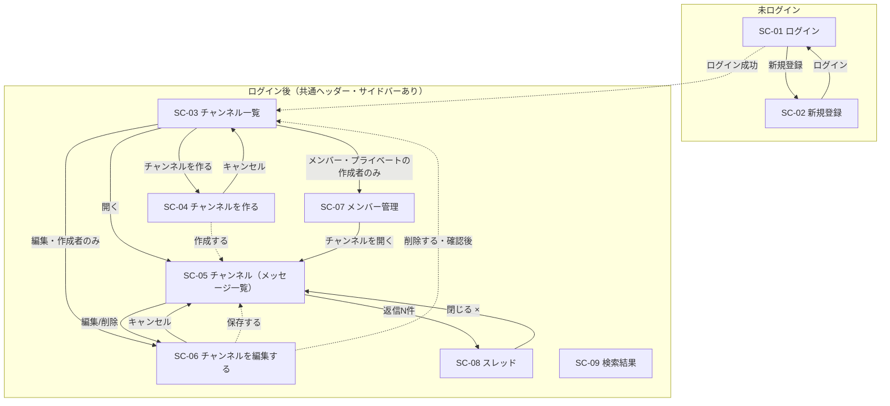

# 画面設計

このファイルは `mockup/`（`index.html` から辿れる9画面）と `mockup/design-guide.md`、`docs/spec.md`、`docs/design/features.md`・`docs/design/questions.md` の4つだけを根拠にしている。この4つに無いことは想像で足していない。ワイヤーフレームは描いていない（モックアップが正であるため）。

## 0. 表記の凡例

- 各表の「根拠」列は、`spec §x-x` （`docs/spec.md`）／ `xxx.html` （モックアップのファイル名）／ `Q-xx` （`docs/design/questions.md` の確認事項とその回答・自分で決めたこと）のいずれかを指す。
- 4つの根拠に直接書かれていないが、画面を成立させるために決めざるを得なかったものには **「※設計判断」** と付けて、決めた理由を必ず添えた。クライアントへの確認が要る事項ではなく、実装の詳細として判断したもの（`questions.md` の「自分で決めること」と同じ扱い）。
- モックアップに実例の無いエラー文言は、`design-guide.md` §4 の書式（1文・句点なし、`{項目名}を入力してください` の型）にならって新規に作成し、表の中で「新規作成」と明記した。実例をそのまま使ったものは「モックアップ実例」と明記した。

---

## 1. 画面一覧

`mockup/index.html` の9画面をすべて対象にした。並び順は画面カタログの順ではなく、ログインを起点にした利用の流れに沿わせた。

| SC-ID | 画面名 | 概要 | 対応する機能 | モックアップ | 要ログイン |
|:--|:--|:--|:--|:--|:--|
| SC-01 | ログイン | メールアドレスとパスワードでログインする | F-02 | `login.html` | 不要（未ログイン専用） |
| SC-02 | 新規登録 | 表示名・メールアドレス・パスワードでアカウントを作る | F-01 | `register.html` | 不要（未ログイン専用） |
| SC-03 | チャンネル一覧 | 自分が見られるチャンネルを一覧表示する。チャンネル作成の入口 | F-04 | `channels.html` | 必要 |
| SC-04 | チャンネルを作る | 名前・説明・公開範囲を入力してチャンネルを作成する | F-05 | `channel-new.html` | 必要 |
| SC-05 | チャンネル（メッセージ一覧） | メッセージの閲覧・投稿・編集・削除ができる。編集画面・スレッドへの入口 | F-06, F-12, F-13, F-14 | `channel-show.html` | 必要 |
| SC-06 | チャンネルを編集する | 作成者が名前・説明を編集する。チャンネル削除もここで行う | F-07, F-08 | `channel-edit.html` | 必要（作成者のみ到達） |
| SC-07 | メンバー管理 | プライベートチャンネルのメンバーを追加・削除する | F-09, F-10, F-11 | `members.html` | 必要（作成者のみ到達） |
| SC-08 | スレッド | メッセージの返信一覧を表示し、返信を投稿する | F-15, F-16 | `thread.html` | 必要 |
| SC-09 | 検索結果 | キーワードでメッセージを検索する | F-17 | `search.html` | 必要（`questions.md`「どのQにも当たらなかった回答」で確定：「検索は、ログインした人だけで構いません」） |

補足（すべて `spec §2` が根拠）: ログインしていない人が読めるのは公開API（F-18, F-19）だけで、画面はSC-01・SC-02以外いっさい開けない。

---

## 2. 画面遷移図

実線 `-->` はモックアップの `href` または仕様書の文面から直接根拠がある遷移。破線 `-.->` は※設計判断（画面を成立させるために決めた遷移で、根拠と理由は図の下の表に記載）。

共通ヘッダー・サイドバー（SC-03〜SC-09のすべてに表示）からの遷移は図が煩雑になるため省略した。実際にはどの画面からでも、サイドバーの「チャンネル一覧を見る」でSC-03へ、サイドバーのチャンネル名でSC-05へ、ヘッダーの検索欄からSC-09へ、「ログアウト」でSC-01へ遷移できる（すべて各モックアップに実例あり）。

### ※設計判断（4つの根拠に直接書かれていない遷移）

| 遷移 | 決めた内容 | 理由 |
|:--|:--|:--|
| SC-01 → SC-03（ログイン成功） | ログイン成功後はチャンネル一覧に着地する | `channels.html` はサイドバーのどの項目も選択中（`is-selected`）になっていない唯一の画面で、他の全画面はいずれかのチャンネルが選択された状態で描かれている。ログイン直後はまだ開くチャンネルを選んでいない状態なので、選択なし状態のSC-03を入口にするのが自然 |
| SC-04 → SC-05（作成する） | チャンネル作成に成功したら、作成したそのチャンネルを開く | `channel-new.html` の「作成する」ボタンに遷移先の指定はない。spec §1 の目的（話題ごとの場所で会話する）に沿えば、作成後すぐそのチャンネルで会話を始められるほうが自然 |
| SC-06 → SC-05（保存する） | 編集を保存したら、そのチャンネルの画面に戻る | 同じ画面の「キャンセル」が `channel-show.html` に戻る指定（モックアップ実例）なので、保存の成功時も同じ戻り先に揃えた |
| SC-06 → SC-03（削除する・確認後） | 削除が成功したら、チャンネル一覧に戻る | 削除されたチャンネルの画面（SC-05）にはもう戻れないため |

補足: `register.html` の「登録する」ボタンの遷移先は図に含めていない。spec §3-1 は「名前・メールアドレス・パスワードで**登録し、そのあとは**メールアドレスとパスワードでログインできれば十分」と書いており、登録とログインを別の操作として扱っている。そのため登録成功後はSC-01（ログイン）に戻す設計とし、これは※設計判断ではなくspec §3-1の文面を根拠にした（図中の SC-02 → SC-01 の実線がこれにあたる）。

### 根拠が無く、あえて描かなかったもの

検索結果（SC-09）の各行には、モックアップ上、遷移先のリンクやボタンが無い（`channels.html` の行にある「開く」のようなボタンが `search.html` の行には無い）。該当メッセージのチャンネルへ飛べたほうが自然にも見えるが、4つの根拠のどこにも遷移の有無・遷移先の記載が無いため、ここでは遷移を定義しなかった。実装の少し手前で判断が必要になった場合は、あらためて確認する。

---

## 3. 画面項目定義

### 3-0. どこまで書いたか

9画面ぶん全部は書かず、次の基準で7画面をフルに定義し、残り2画面は差分だけ書いた。

- **フォームや一覧の「型」が初めて出てくる画面**をフルに定義した（ログイン・新規登録・チャンネル一覧・チャンネルを作る・チャンネル・メンバー管理の6画面）
- 検索結果は一覧の型に近いが、キーワード強調(`mark`)と0件表示という他画面にない要素を持つため、7画面目として独立させた
- 既に出た型をそのまま使う画面は「◯◯と同じ」で済ませた
  - **チャンネルを編集する（SC-06）**: 名前・説明の入力欄はチャンネルを作る（SC-04）と同じ型。差分（公開範囲の欄が無い・初期値が入っている）と、SC-04に無い削除確認だけを定義した
  - **スレッド（SC-08）**: メッセージの表示・投稿欄はチャンネル（SC-05）と完全に同じ型。差分（元メッセージの固定表示・見出し・placeholder文言・閉じるボタン）だけを定義した

**共通レイアウト（ヘッダー・サイドバー）**（2026-08-18 追記）

SC-03〜SC-09 の7画面すべてが同じヘッダーとサイドバーを持つ（`channels.html` ほか7枚のモックアップで、この2つは `is-selected` の位置以外バイト単位で同一）。画面ごとに繰り返さず、ここに1回だけ書く。SC-01・SC-02 はこの枠を使わない別構造。

| 位置 | 項目 | 備考 |
|:--|:--|:--|
| ヘッダー | アプリ名「チームチャットアプリ」 | spec §5-3 でこの表記に統一 |
| ヘッダー | 検索窓（プレースホルダ「メッセージを検索」） | → SC-09（F-17） |
| ヘッダー | ログイン中の表示名／「ログアウト」 | ログアウトは `POST /logout`（`permissions-api.md` 2章） |
| サイドバー | グループ見出し「チャンネル」 | |
| サイドバー | 見られるチャンネルの一覧（`#`記号＝公開／鍵アイコン＝プライベート＋チャンネル名） | 出るのは公開チャンネル全部と、自分がメンバーのプライベートだけ（Q-04）。メンバーでないプライベートは名前も出ない。→ 各 SC-05 |
| サイドバー | いま開いているチャンネルの選択中表示 | `design-guide.md` §4「選択中（サイドバー）」 |
| サイドバー | 足元のリンク「チャンネル一覧を見る」 | → SC-03 |

サイドバーとSC-03の一覧の**並び順は `id` の昇順（作成順）**とする（※設計判断: モックアップ4枚のサイドバーとSC-03の一覧はどれも「全体連絡→開発→雑談→採用プロジェクト」で、これは spec §5-4 のチャンネル4件の並びと一致する。名前順・更新順ではこの並びにならないため、作成順と読んだ）。

### 3-1. SC-01 ログイン（`login.html`）

| 項目 | 種別 | 必須 | 初期値・プレースホルダ | 備考 |
|:--|:--|:--|:--|:--|
| メールアドレス | テキスト入力 | 必須 | なし | |
| パスワード | パスワード入力 | 必須 | なし | |
| ログイン（ボタン） | 主ボタン・大・横幅いっぱい | - | ラベル「ログイン」 | |
| 新規登録（リンク） | テキストリンク | - | 「アカウントをお持ちでない方は 新規登録」 | → SC-02 |

エラー表示: メールアドレス・パスワードのどちらかが誤っている場合、パスワード欄を赤枠にして「メールアドレスまたはパスワードが正しくありません」（モックアップ実例、`login.html`）。メールとパスワードのどちらが間違っているかを教えない一般的な認証エラー文なので、そのまま踏襲する。

### 3-2. SC-02 新規登録（`register.html`）

| 項目 | 種別 | 必須 | 上限 | 初期値・補足表示 | 備考 |
|:--|:--|:--|:--|:--|:--|
| 表示名 | テキスト入力 | 必須 | 30文字（spec §5-1） | 補足「メッセージに表示される名前です。」／文字数カウンタ「{n} / 30」 | |
| メールアドレス | テキスト入力 | 必須 | 記載なし（下記4章） | | |
| パスワード | パスワード入力 | 必須 | 8文字以上・上限なし（spec §5-1） | 補足「8文字以上で入力してください。」 | |
| パスワード（確認用） | パスワード入力 | 必須 | パスワードと同じ | | パスワードと一致必須 |
| 登録する（ボタン） | 主ボタン・大・横幅いっぱい | - | - | - | |
| ログイン（リンク） | テキストリンク | - | - | 「すでにアカウントをお持ちの方は ログイン」 | → SC-01 |

### 3-3. SC-03 チャンネル一覧（`channels.html`）

| 項目 | 種別 | 備考 |
|:--|:--|:--|
| 見出し | 「チャンネル一覧」＋補足「公開チャンネルは、ログインしている社員なら誰でも読み書きできます。」 | |
| チャンネルを作る（ボタン） | 主ボタン | → SC-04 |
| 一覧の行（1チャンネルにつき1行） | `#`記号（公開）または鍵アイコン（プライベート）＋チャンネル名＋バッジ（「公開」／「プライベート」）／説明・「作成者：{表示名}」 | |
| 行内アクション「開く」 | 全員に表示 | → SC-05 |
| 行内アクション「編集」 | **作成者にだけ**表示（features.md F-07） | → SC-06 |
| 行内アクション「メンバー」 | **プライベートチャンネルの作成者にだけ**表示（features.md F-09〜F-11） | → SC-07。実装単位(3)で出す（下記） |

Q-04の回答（`questions.md`）により、自分がメンバーでないプライベートチャンネルはこの一覧に**そもそも行が出ない**。0件になった場合の表示は `design-guide.md` §4 の空状態の型（破線枠・見出しに事実・下に次の一手）に沿わせ、見出し「見られるチャンネルがありません」、その下の補足「「チャンネルを作る」から、最初のチャンネルを作ってください。」とする（※設計判断: モックアップに0件時の実例が無いため、`search.html` の0件表示と同じ「事実＋次の一手」の型で新規に決めた。「チャンネルがまだありません」ではなく「見られるチャンネルがありません」としたのは、Q-04により他人のプライベートチャンネルが自分に見えていないだけの場合があり、存在しないと言い切らないため）。

一覧の並び順は共通レイアウトのサイドバーと同じく `id` の昇順（3-0の追記）。

**「メンバー」ボタンは実装単位(3)（メンバー管理）で出す**（2026-08-18 追記）。遷移先の `GET /channels/{channel}/members` は F-09〜F-11 の担当で、実装単位(2)（チャンネル）の時点ではルート自体が存在しない。存在しないルートへのリンクは描けないため、行内アクションのうちこの1つだけを実装単位(3)へ回す（※設計判断: 画面の項目を減らす判断だが、この行は元から「プライベートチャンネルの作成者にだけ」出る条件付きの項目で、実装単位(3)が入った時点で表のとおりに揃う。項目そのものを取り下げたわけではない）。

### 3-4. SC-04 チャンネルを作る（`channel-new.html`）

| 項目 | 種別 | 必須 | 上限 | 初期値・補足表示 | 備考 |
|:--|:--|:--|:--|:--|:--|
| チャンネル名 | テキスト入力 | 必須 | 50文字（spec §5-1） | 文字数カウンタ「{n} / 50」 | |
| 説明 | テキストエリア | 任意 | 200文字（spec §5-1） | 補足「何について話す場所かを短く書きます。」／文字数カウンタ「{n} / 200」 | |
| 公開範囲 | ラジオボタン（「公開」／「プライベート」） | 必須（初期値「公開」が選択済みのため未選択状態は起きない） | - | 「公開」説明「ログインしている社員なら誰でも読み書きできます。」／「プライベート」説明「追加された人だけが読み書きできます。作成者がメンバーを管理します。」 | |
| キャンセル（リンク） | テキストボタン | - | - | - | → SC-03 |
| 作成する（ボタン） | 主ボタン | - | - | - | → SC-05（2章の※設計判断） |

チャンネル名は重複不可（Q-03の回答）。作成者は自動的にそのチャンネルのメンバーになる（features.md F-05、spec §3-2）。

### 3-5. SC-05 チャンネル（メッセージ一覧）（`channel-show.html`）

| 項目 | 種別 | 備考 |
|:--|:--|:--|
| チャンネル見出し | `#`／鍵記号＋チャンネル名＋バッジ（公開/プライベート）＋説明文 | |
| 編集（ボタン） | 作成者にだけ表示 | → SC-06 |
| 削除（ボタン） | 作成者にだけ表示 | → SC-06（削除確認はSC-06内） |
| 日付区切り | 「{年}年{月}月{日}日（{曜}）」形式（モックアップ実例「2026年8月17日（月）」） | メッセージの並び順は**古いものが上・新しいものが下**（`questions.md`「どのQにも当たらなかった回答」で確定） |
| メッセージ1件 | アバター（頭文字2字・人ごとに固定色）／投稿者名／日時「{yyyy/mm/dd hh:mm}」（`design-guide.md` §2で固定書式）／本文 | ホバー時に「返信／編集／削除」の操作アイコンが出る。**返信は全メッセージに表示**、**編集・削除は自分の投稿にだけ**表示する（`design-guide.md` §4「メッセージのホバー操作」）。**ただし自分の投稿でも削除済みのものには編集・削除は出さない**（返信のみ表示。`behavior.md` 1章の状態遷移図で「削除済み」を終端状態とした） |
| 編集済みの印 | 本文末尾に「編集済み」（`design-guide.md` §4） | 編集回数・期限の制限なし（`questions.md`「どのQにも当たらなかった回答」で確定） |
| 削除済みの表示 | 本文の代わりに「このメッセージは削除されました」（`design-guide.md` §4） | 削除済みメッセージにも返信を続けられる（同上で確定）。返信件数の表示も消さない |
| 返信リンク | 「返信{n}件」（返信が1件以上ある場合のみ） | → SC-08 |
| 投稿欄 | テキストエリア（placeholder「#{チャンネル名} にメッセージを送る」）／文字数カウンタ「{n} / 1,000 文字」／送信（主ボタン・小） | 本文は必須・1000文字以内（spec §5-1）。空欄や超過時の送信ボタンの扱いは `questions.md`「自分で決めること」のとおり実装判断（4章） |

**ホバー操作の出し分けについて**（実装時に追記、2026-08-19）: 「ホバー時に操作アイコンが出る」は **CSSだけで実現する**（※設計判断）。`mockup/styles.css` の `.msg__acts` には表示・非表示の切り替えが無く、`channel-show.html` は自分のメッセージ1件でその枠を常に描いてホバー時の見え方を示している。見本のとおりに常時表示にすると自分のメッセージすべてに枠が出続けてしまうため、`public/css/app.css` 末尾の「アプリ側の追加」に `.msg__acts` を既定で隠し、`.msg:hover` と `.msg:focus-within` で出す規則を足した（`:focus-within` を入れたのは、キーボードだけで操作する人がアイコンに到達できるようにするため）。JavaScript は使わない（4章で決めた使用範囲の外）。

**編集中（メッセージ）のマークアップについて**（実装時に追記、2026-08-19）: `mockup/` にメッセージ編集中の見本が無いため、`design-guide.md` §4「編集中（メッセージ）」の記述だけを根拠に組み立てた（※設計判断）。本文があった位置を `textarea` に差し替え、その下に「保存」（塗り）と「やめる」を横並びに置く。「やめる」は `/channels/{channel}` へ戻るリンクにする（JavaScript で開閉しない）。まわりのメッセージは通常表示のままにする。文字数カウンタは投稿欄と同じものを付ける。

### 3-6. SC-06 チャンネルを編集する（`channel-edit.html`）— SC-04との差分

| 項目 | SC-04との違い |
|:--|:--|
| チャンネル名 | 初期値に編集対象の現在の名前が入る。それ以外（必須・50文字・重複不可）はSC-04と同じ。公開チャンネルの場合、補足「公開チャンネルです。公開範囲はあとから変更できません。」（モックアップ実例）。プライベートの場合は「プライベートチャンネルです。公開範囲はあとから変更できません。」（※設計判断: モックアップに実例が無いため、公開チャンネルの実例と同じ型のまま先頭の語だけを入れ替えて決めた） |
| 説明 | 初期値に編集対象の現在の説明が入る。それ以外（任意・200文字）はSC-04と同じ |
| 公開範囲 | この画面には無い（作成後に変更できないため。features.md F-07） |
| キャンセル（リンク） | → SC-05（モックアップ実例） |
| 保存する（ボタン） | → SC-05（2章の※設計判断） |

削除確認（この画面にしかない要素）:

| 項目 | 種別 | 備考 |
|:--|:--|:--|
| 見出し「チャンネルを削除する」＋警告文「このチャンネルを削除します」＋補足「メッセージと返信もすべて削除され、元に戻せません。」 | 表示のみ | チャンネルを消すとメッセージも一緒に消える（`questions.md`「どのQにも当たらなかった回答」で確定） |
| 削除する（ボタン・危険色） | 主ボタン | 押すと下の確認カードを開く（同一画面内） |
| 確認カード見出し「『{チャンネル名}』を削除しますか？」 | 表示のみ | |
| 確認カード本文「メッセージ {n}件と返信 {m}件も削除されます。この操作は取り消せません。確認のためチャンネル名を入力してください。」 | 表示のみ | モックアップ実例（`channel-edit.html` は「メッセージ 9件と返信 5件」の例） |
| 確認入力欄 | テキスト入力 | プレースホルダに正しいチャンネル名（モックアップ実例） |
| やめる（ボタン） | ボタン | 確認カードを閉じる（同一画面内） |
| 削除する（ボタン・塗り危険色） | 主ボタン | 確認入力欄の値がチャンネル名と一致するまで押せない（`design-guide.md` §4「押せない」の型）。一致後に押すと → SC-03（2章の※設計判断） |

**確認カード本文の件数について**（2026-08-18 追記／2026-08-19 更新）: `{n}` `{m}` は `messages` を数えた値だが、`messages` テーブルは実装単位(4)（メッセージ）で作る。実装単位(2)（チャンネル）の時点ではテーブルが無いため、暫定で「メッセージ 0件と返信 0件も削除されます。」と表示していた。**実装単位(4)で実データに繋いだ**（2026-08-19）。数え方は `{n}`＝そのチャンネルの `parent_message_id` が NULL の行数、`{m}`＝ NULL でない行数。どちらも `deleted_at` を問わず数える（※設計判断: チャンネルの削除は物理削除で、削除済みメッセージの行も一緒に消えるため。`data.md` 2-2）。

**「削除する」（危険色・上段）の実現方法**: 確認カードは同じページ内に常に描画し、この上段のボタンは確認カードへのページ内アンカーにする（`permissions-api.md` 2章の※設計判断）。JavaScript で開閉しない。

### 3-7. SC-07 メンバー管理（`members.html`）

| 項目 | 種別 | 備考 |
|:--|:--|:--|
| 見出し | アイコン＋チャンネル名＋バッジ「プライベート」＋補足「{説明}・追加された人だけが読み書きできます。」 | |
| チャンネルを開く（ボタン） | ボタン | → SC-05 |
| 追加フォーム見出し「メンバーを追加する」 | 表示のみ | |
| 検索キー入力欄 | テキスト入力（placeholder「表示名またはメールアドレスで探す」） | 表示名またはメールアドレスの完全一致で対象者を1人に特定する想定（Q-06、回答なしのため自分で決めた設計） |
| 追加（ボタン） | 主ボタン | 同一画面内で一覧に追加（画面遷移なし） |
| メンバー一覧見出し「メンバー　{n}人」 | 表示のみ | |
| メンバー行 | アバター／氏名（作成者には「作成者」バッジ）／メールアドレス | |
| 外す（ボタン） | 危険色ボタン | 作成者の行は押せない状態＋補足「作成者は外せません」（モックアップ実例）。作成者はメンバーから外れられない（`questions.md`「どのQにも当たらなかった回答」でも確定）。作成者の行のボタンには危険色（`btn--danger`）を付けない（モックアップ実例。押せないボタンを危険色にしていない） |

**メンバー一覧の並び順**（実装時に追記、2026-08-19）: `channel_user.created_at` の昇順（参加した順）、同時刻なら `users.id` の昇順。※設計判断（モックアップ・仕様書のどちらにも並び順の指定が無いため）。理由: 作成者の行は必ず最初に入る（`data.md` 2-3）ので参加順に並べると作成者が先頭に来て、`mockup/members.html` の「佐藤 太郎（作成者）→ 鈴木 花子」の並びと一致する。初期データは作成者と他のメンバーを同じ秒に登録するため、`created_at` だけでは先頭が定まらない。第2キーの `users.id` はそのための同順位の決着。

### 3-8. SC-08 スレッド（`thread.html`）— SC-05との差分

メッセージの表示・投稿欄の型はSC-05と同じ（アバター・投稿者名・日時・本文・編集済み/削除済み表示・ホバー操作・文字数カウンタも同じ）。この画面だけにある要素は次のとおり。

| 項目 | 種別 | 備考 |
|:--|:--|:--|
| パネル見出し「スレッド」＋対象チャンネル名 | 表示のみ | |
| 閉じる（ボタン・×） | ボタン | → SC-05（画面遷移というより、パネルを閉じる操作） |
| 元メッセージ | SC-05のメッセージ表示と同じ型で、パネル上部に固定表示 | 削除済みの元メッセージにも返信を続けられる（`questions.md`「どのQにも当たらなかった回答」） |
| 返信件数見出し「返信{n}件」 | 表示のみ | |
| 投稿欄のplaceholder | 「返信を送る」（SC-05は「#{チャンネル名} にメッセージを送る」） | 返信への返信（ネスト）はできない（Q-07の回答） |

### 3-9. SC-09 検索結果（`search.html`）

| 項目 | 種別 | 備考 |
|:--|:--|:--|
| 見出し「メッセージを検索」 | 表示のみ | |
| 検索フォーム | テキスト入力（値=検索したキーワード）＋検索（主ボタン） | 対象はメッセージ本文のみ。チャンネル名・投稿者名は検索対象外（`questions.md`「どのQにも当たらなかった回答」で確定） |
| 結果件数見出し | 「『{キーワード}』の検索結果　{n}件」 | |
| 結果の行（1件につき1行） | `#`／鍵アイコン＋チャンネル名／投稿者名／日時／本文（一致箇所を`mark`で強調表示） | 自分が見られるチャンネルの範囲に限る（spec §3-6、features.md F-17）。行自体に遷移リンクは無い（2章「根拠が無く、あえて描かなかったもの」参照） |
| 0件時の見出し | 「『{キーワード}』に一致するメッセージはありません」（モックアップ実例） | |
| 0件時の補足 | 「別のキーワードで試すか、キーワードを短くしてください。」（モックアップ実例） | |

---

## 4. 入力チェックとエラーメッセージ

画面をまたいで使う項目は、ここに1回だけまとめた。3章の各画面では「必須／上限」だけを示し、実際のチェック内容とエラー文はこの章を見る。

この章で、`questions.md`「自分で決めること」に残っていた3項目を確定させた。空欄・上限超過は**送信・実行系ボタンを押せない状態にする方式**、文字数カウンタは**入力に追随させる方式**（「{n} / 1,000 文字」がリアルタイムに変わる）を採用する。この2つは投稿欄（本文）だけでなく、表示名・チャンネル名・説明の各入力欄（カウンタ）と、検索ボタン・チャンネル削除の確認ボタン（活性/非活性）にも同じ方式を使う。そのためJavaScriptの使用可否は**使う**（文字数カウンタの表示と、送信・実行系ボタンの活性・非活性の切り替えに限定し、画面遷移そのものはJSに頼らない）と決めた。

| 項目 | 対象画面 | ルール | エラーメッセージ | 文言の根拠 |
|:--|:--|:--|:--|:--|
| メールアドレス（登録） | SC-02 | 必須。メール形式。登録済みのアドレスは不可（ログインの一意性に必要、`login.html` のエラー文と spec §3-1 から） | 空欄:「メールアドレスを入力してください」／形式不正:「メールアドレスの形式が正しくありません」／重複:「このメールアドレスはすでに登録されています」 | 新規作成（design-guide.mdの型にならった） |
| メールアドレス／パスワード（ログイン） | SC-01 | 必須。どちらか空欄でも、両方入力していて認証に失敗した場合でも、区別なく同じ文言にする | 認証失敗:「メールアドレスまたはパスワードが正しくありません」／空欄:「メールアドレスを入力してください」「パスワードを入力してください」 | 認証失敗はモックアップ実例（`login.html`）。空欄チェックは新規作成 |
| パスワード（登録） | SC-02 | 必須。8文字以上、上限なし（spec §5-1「上限は決めなくて構いません」をそのまま採用し、本設計でも上限を設けない） | 空欄:「パスワードを入力してください」／8文字未満:「パスワードは8文字以上で入力してください」 | 新規作成 |
| パスワード（確認用） | SC-02 | 必須。パスワードと一致すること | 空欄:「パスワード（確認用）を入力してください」／不一致:「パスワードが一致しません」 | 新規作成 |
| 表示名 | SC-02 | 必須、30文字以内（spec §5-1） | 空欄:「表示名を入力してください」／超過:「表示名は30文字以内で入力してください」 | 新規作成 |
| チャンネル名 | SC-04, SC-06 | 必須、50文字以内（spec §5-1）、重複不可（Q-03の回答） | 空欄:「チャンネル名を入力してください」／超過:「チャンネル名は50文字以内で入力してください」／重複:「同じ名前のチャンネルがすでにあります」 | 空欄はモックアップ実例（`channel-new.html`）。超過・重複は新規作成 |
| チャンネルの説明 | SC-04, SC-06 | 任意、200文字以内（spec §5-1） | 超過:「説明は200文字以内で入力してください」 | 新規作成 |
| メッセージ本文（投稿・編集・返信） | SC-05, SC-08 | 必須、1000文字以内（spec §5-1）。空欄・超過時の扱いは実装判断（下記） | 超過時は文字数表示を赤字太字にする（`design-guide.md` §4「文字数」） | 空欄・超過時に送信ボタンを押せない状態にする方式を採用（`design-guide.md` §4「押せない」の型を流用）。文言によるエラー表示はしない |
| メンバー追加の検索キー | SC-07 | 必須。表示名またはメールアドレスの完全一致（Q-06、回答なしのため自分で決めた）。**完全一致が2人以上に当たったとき**（表示名の重複）は、1人に特定できないので「該当なし」と同じ扱いにする（実装時に追記、2026-08-19。※設計判断: この状況を指す文言がこの表に無く、新しいエラー文を増やさないため。Q-06 の想定「表示名が重複する社員がいる場合はメールアドレスでの特定が必須になる」に沿った扱い） | 空欄:「表示名またはメールアドレスを入力してください」／該当なし（2人以上に一致した場合を含む）:「該当する社員が見つかりません」／既にメンバー:「すでにメンバーです」 | 新規作成 |
| チャンネル削除の確認入力 | SC-06 | 必須。チャンネル名と完全一致するまで削除ボタンを押せない | エラー文は出さず、ボタンを押せない状態で表現する（`design-guide.md` §4「押せない」） | design-guide.mdの型をそのまま適用 |
| 検索キーワード | SC-09 | 必須。対象はメッセージ本文のみ（チャンネル名・投稿者名は対象外、`questions.md`「どのQにも当たらなかった回答」で確定）。空欄時は検索ボタンを押せない状態にする | 0件時、見出し「『{キーワード}』に一致するメッセージはありません」／本文「別のキーワードで試すか、キーワードを短くしてください。」 | モックアップ実例（`search.html`） |

**「押せない状態にする」対象について**（実装時に追記、2026-08-19）: 上の表の「メッセージ本文（投稿・編集・返信）」の行は対象画面が SC-05・SC-08 で、投稿欄の送信だけでなく**メッセージ編集の「保存」も同じ方式の対象にする**。この欄は「文言によるエラー表示はしない」と決めているため、空欄・超過のまま保存を押せてしまうと、何も起きずに元の画面へ戻るだけになり、使う人には理由が分からない。チャンネル編集（SC-06）の「保存する」はこの行の対象ではない（チャンネル名・説明はエラー文を出す欄なので、押せる状態のままにしてサーバ側のエラー文で知らせる）。

---

## 根拠にした資料

- `docs/spec.md`（全文、とくに §2, §3-1〜3-7, §5-1）
- `mockup/index.html`（画面カタログ）
- `mockup/login.html`, `register.html`, `channels.html`, `channel-new.html`, `channel-show.html`, `channel-edit.html`, `members.html`, `thread.html`, `search.html`
- `mockup/design-guide.md`（状態の決まり全般）
- `docs/design/features.md`（機能一覧、今回作らないもの）
- `docs/design/questions.md`（確認事項とクライアントの回答、どのQにも当たらなかった回答、自分で決めたこと）
